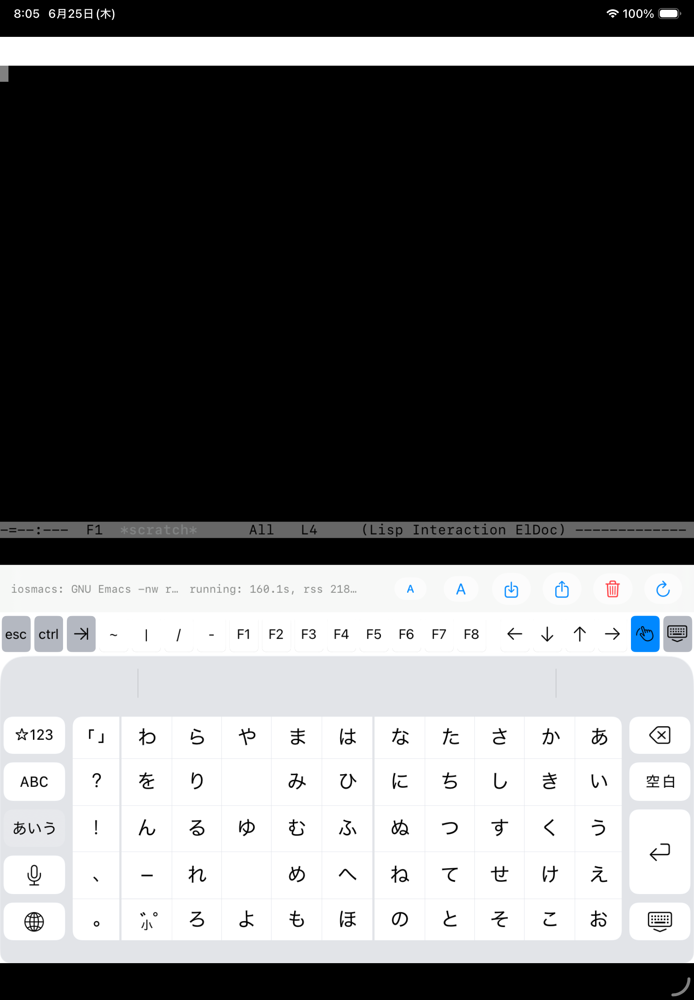

# iosmacs

`iosmacs` is an experiment to run real GNU Emacs on iOS and iPadOS as a native
Swift application.

The project does not aim for App Store distribution. The expected user is a
developer who builds the app locally with Xcode and installs it on their own
iPhone or iPad in a development state.

## Goal

The first goal is a small, honest Emacs:

- Bundle the GNU Emacs C core and standard Lisp files inside the app.
- Start Emacs in a `--quick --no-splash -nw` style session.
- Reach `*scratch*`.
- Connect Emacs terminal input and output to a Swift terminal grid.
- Support `find-file`, save, and Dired inside the app container.

This is not an Emacs-like editor. The editor semantics should remain owned by
GNU Emacs itself.

## Reference

This repository includes `wasmacs` as a submodule:

```sh
git submodule update --init --recursive
```

`wasmacs` is used as architectural reference material. It proved useful
boundaries for running GNU Emacs outside a normal POSIX desktop environment:
filesystem, terminal input, lifecycle, memory/root safety, network capability,
and explicit unavailable process APIs.

`iosmacs` does not intend to run the `wasmacs` browser bundle inside a WebView.
Instead, it translates the same small-OS idea into a Swift iOS/iPadOS host.

## Terminal Layer

The iOS terminal view uses
[SwiftTerm](https://github.com/migueldeicaza/SwiftTerm) as the native
counterpart to the `wasmacs` xterm.js layer. iosmacs owns the embedded Emacs
session and byte transport; SwiftTerm owns terminal parsing, rendering,
selection, cursor state, and keyboard input.

SwiftTerm is intentionally used as a terminal emulator only. iosmacs does not
delegate process, PTY, shell, or SSH ownership to SwiftTerm.

## Supported Devices

The Xcode target supports both iPhone and iPad device families
(`TARGETED_DEVICE_FAMILY = "1,2"`). The current proof path is still simulator
first:

```sh
make app
make app-iphone
```

`make app` builds the default iOS simulator destination, and
`make app-iphone` explicitly builds an iPhone simulator destination. Physical
device builds still require local signing setup.

## MVP Scope

The MVP should include:

- Native iOS/iPadOS app shell written in Swift.
- GNU Emacs core built for iOS and linked or embedded with the app.
- Standard Emacs Lisp tree bundled as read-only app resources.
- Writable user workspace under the app container.
- A Swift terminal grid that displays the `--nw` terminal stream.
- Keyboard input from hardware keyboard and software keyboard.
- Basic file operations in the app container.
- Dired using Emacs Lisp filesystem primitives, not an external `ls`.

The MVP should explicitly exclude:

- App Store distribution.
- Subprocesses and arbitrary command execution.
- PTY emulation beyond what the embedded Emacs terminal path needs.
- Shell commands.
- Native compilation.
- TRAMP.
- Full socket/process behavior.
- Arbitrary package installation from the network.
- Mounting arbitrary host filesystem paths without user-controlled import.

## Development Stance

The project should prefer a narrow, inspectable host boundary over broad POSIX
emulation. Unsupported behavior should fail clearly instead of pretending to
work.

The first useful milestone is not performance. It is seeing real Emacs reach
`*scratch*` on an iPhone or iPad and proving that input, redisplay,
`find-file`, save, and Dired are owned by Emacs rather than reimplemented in
Swift.

## License

`iosmacs` links and bundles GNU Emacs, so the project is distributed under
GPL-3.0-or-later as a whole. See `LICENSE` for the GPL text and
`THIRD_PARTY_NOTICES.md` for the current upstream component inventory.

The project is intended for local developer builds and does not target App
Store distribution.

## Screenshot



## Development Commands

From a fresh checkout, run the project verification target:

```sh
make verify
```

`make verify` initializes submodules, prints the pinned Emacs source identity,
builds the linkable Emacs archive, runs link and batch smoke checks, and builds
the iOS simulator app. It expects macOS with Xcode command line tools available.
Use `make verify-iphone` to run the same proof with an explicit iPhone
simulator build.

Initialize the reference source:

```sh
make deps
```

`make deps` initializes `wasmacs` and its nested GNU Emacs source submodule.
`make emacs-info` prints the exact Emacs source remote, commit, and tag.

Build the iOS simulator app:

```sh
make app
```

Remove generated build outputs:

```sh
make clean
```

`make clean` removes repo-local generated outputs under `build/`.
`make distclean` also removes this project's Xcode DerivedData directory.

The simulator app target runs `scripts/build-emacs-ios-static-probe.sh` before
linking. If `build/emacs-ios-probe/iosmacs/libiosmacs-temacs.a` already exists
and still exports `iosmacs_emacs_main` without exporting `main`, the build phase
reuses it. Set `IOSMACS_FORCE_EMACS_BUILD=1` to force a rebuild.

Probe the GNU Emacs iOS simulator build:

```sh
make emacs-temacs
```

Build the linkable static archive probe:

```sh
make emacs-static
```

Verify that the archive can link into an iOS simulator executable without a
duplicate `main`:

```sh
make emacs-link-smoke
```

Run the renamed Emacs entrypoint in iOS simulator batch mode:

```sh
make emacs-batch-smoke
```

To exercise the first non-batch terminal boundary, run:

```sh
make emacs-nw-smoke
```

That smoke provides the minimum iOS-side TTY answers that terminal Emacs asks
for before SwiftTerm can render the byte stream: `isatty`, `/dev/tty`,
`tcgetattr`/`tcsetattr`, `tcflow`, `tcdrain`, `tcflush`,
`tcgetpgrp`/`tcsetpgrp`, and window-size ioctls. The fake TTY is backed by a
socketpair and is attached to stdin/stdout/stderr with `dup2`; a mirrored fd
keeps simulator logs observable while SwiftTerm receives the same ANSI/xterm
byte stream through the app-owned ring buffer.

The implementation now lives in `iosmacs/Host/iosmacs_terminal_shim.c` and is
compiled into the app target; the smoke uses the same source file. The smoke
also builds a local `emacs.pdmp` with the same simulator executable that later
loads it, because portable dumps are tied to the loading executable. Set
`IOSMACS_NW_EXPECT_FULL=1` to make the script require the later `iosmacs-nw-ok`
evaluated-Lisp marker. The current full smoke reaches `recursive_edit`,
`normal-top-level`, `command-line-1`, draws the initial `*scratch*` terminal
frame, evaluates the `--eval` form, and exits with the `iosmacs-nw-ok` marker.
The smoke also writes a marker file next to the generated executable so success
does not depend only on terminal-output flush timing around `kill-emacs`.

The skip-free `xterm-256color` smoke now reaches the evaluated-Lisp marker.
The host facade includes an env-gated smoke helper,
`IOSMACS_TERMINAL_AUTO_XTERM_REPLIES=1`, for common xterm DA, DSR, window-size,
and OSC color replies. The app leaves that helper off because SwiftTerm is
expected to own those terminal replies through its parser and delegate
callbacks.

The smoke has two input-oriented modes:
`IOSMACS_NW_EXPECT_INPUT=1` attempts to read a byte from `--eval`, and
`IOSMACS_NW_EXPECT_COMMAND_INPUT=1` injects `abc` into the command loop. The
fake TTY reports real pending socket bytes for `FIONREAD`, so the first mode
proves a byte reaches Emacs' `read-char`. The command-loop mode verifies that
the injected `abc` reaches terminal Emacs and appears in the `*scratch*` buffer.
The pdump used by iosmacs records eager macro expansion as skipped at runtime so
source Lisp loaded from the iOS bundle does not stop startup with eager
macro-expansion warnings.

The batch smoke defaults to the generated build tree. To verify the copied app
bundle resources, pass `IOSMACS_EMACS_LISP_DIR` and `IOSMACS_EMACS_ETC_DIR`.
For example:

```sh
APP="$HOME/Library/Developer/Xcode/DerivedData/iosmacs-hdzmfzuognbdkeewcsijoqkfrawm/Build/Products/Debug-iphonesimulator/iosmacs.app"
IOSMACS_EMACS_LISP_DIR="$APP/lisp" \
IOSMACS_EMACS_ETC_DIR="$APP/etc" \
  scripts/run-emacs-ios-batch-smoke.sh
```

The current app starts the linked GNU Emacs `-nw` probe through SwiftTerm in
the iOS simulator. The Emacs probes prove that the simulator `temacs` artifact
links and that the same object set can be packaged as
`build/emacs-ios-probe/iosmacs/libiosmacs-temacs.a` with `main` renamed to
`iosmacs_emacs_main`. The Xcode simulator target links that archive, copies the
generated `lisp`, `etc`, `lib-src`, and `emacs.pdmp` resources into the app
bundle, and launches the renamed entrypoint on a background thread.

The `-nw` path now opens the app-owned fake TTY, emits ANSI/xterm bytes through
the shared ring buffer, and SwiftTerm renders that stream. The script-level full
smoke proves skip-free `-nw` startup through the evaluated-Lisp marker. The
script-level input smokes prove fake-TTY bytes reach both `read-char` and
command-loop insertion into `*scratch*`.

The app-level SwiftTerm smoke now verifies the same input path in the running
iOS simulator app: after SwiftTerm renders a ready Lisp Interaction frame, an
env-gated test calls `TerminalView.insertText("abc")`, forwards the resulting
delegate bytes to the fake TTY, and an Emacs marker confirms that `abc` appears
in `*scratch*`.

Local editing is rooted at `/home/user` inside Emacs and maps to
`Documents/home/user` in the iOS app container. The app creates an initial
`README.txt` and `notes/` directory on first launch. The path shim translates
the POSIX file operations Emacs uses for `find-file`, save/reload, and Dired,
while startup Lisp forces Dired through `ls-lisp` so it does not need an
external `ls` process. Verify the script-level file path with:

```sh
IOSMACS_NW_EXPECT_FILE_OPS=1 \
IOSMACS_NW_EXPECT_FULL=1 \
  scripts/run-emacs-ios-nw-smoke.sh
```

The simulator app has an env-gated file smoke,
`IOSMACS_APP_FILE_SMOKE_MARKER`, that creates, saves, reopens, and lists
`/home/user/notes/iosmacs-file-smoke.txt` from the running SwiftTerm-backed
app. The saved file persists under the app container's `Documents/home/user`.
The app toolbar includes Import and Export controls: Import copies selected
iPadOS document-picker files into `/home/user`, and Export presents the current
workspace contents through the iPadOS document picker as copies.

The bottom toolbar also includes font-size controls, workspace reset, and a
terminal redraw action. The status strip shows the current lifecycle state plus
simple startup elapsed time and resident-memory telemetry. Hardware keyboard
shortcuts are available for the app-level controls: Command-- and Command-= for
font size, Command-Shift-I for Import, Command-Shift-E for Export,
Command-Shift-R for workspace reset, and Control-L for redraw.

Known unsupported Emacs features in this MVP:

- Full subprocess support is not available; shell buffers and tools that spawn
  external processes are expected to fail.
- TRAMP, LSP servers, native compilation, and arbitrary package-managed native
  executables are out of scope.
- Dired local listing is supported through `ls-lisp`, not through an external
  `/bin/ls`.
- The iOS app currently targets the simulator proof path; device signing and
  App Store distribution remain separate work.
- `/home/user` prefers the app's iCloud ubiquity container when available and
  falls back to app Documents otherwise; simulator iCloud behavior still
  depends on signing/account/entitlement setup.
- xterm 256-color style SGR output is covered by the app color smoke through
  SwiftTerm.
- Network package installation is covered for pure Elisp packages by
  `IOSMACS_NW_EXPECT_NETWORK=1 scripts/run-emacs-ios-nw-smoke.sh`: it downloads
  `a68-mode` from GNU ELPA, installs it with byte/native compilation disabled,
  and verifies `require` from `/home/user/elpa`.
